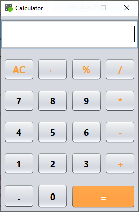
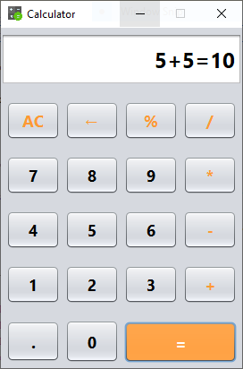

# 🧮 Java Swing Calculator

A simple and user-friendly **Calculator Desktop Application** built using **Java Swing**.
It supports basic arithmetic operations with a clean UI and real-time expression display.

---

## 🚀 Features

* ➕ Addition
* ➖ Subtraction
* ✖ Multiplication
* ➗ Division
* 🧮 Modulus (%)
* 🔢 Decimal support
* ⌫ Backspace
* 🧹 Clear (AC)
* 📟 Expression display (e.g., `5+5=10`)
* 🎯 Clean result formatting (removes `.0` when not needed)

---

## 🖥️ Tech Stack

* **Java**
* **Java Swing (GUI)**
* **NetBeans IDE**

---

## 📂 Project Structure

```
Calculator/
│── src/
│   └── Calculator/
│       └── Calculator.java
│── README.md
```

---

## ⚙️ How to Run

1. Clone the repository:

```
git clone https://github.com/your-username/calculator-java-swing.git
```

2. Open in **NetBeans / Eclipse / IntelliJ**

3. Run the file:

```
Calculator.java
```

---

## 📸 Screenshots




---

## 💡 How It Works

* Stores first number when operator is clicked
* Displays operator in UI
* Extracts second number from expression
* Calculates result on `=`
* Formats output (removes unnecessary decimals)

---

## 🔥 Example

```
Input:  5 + 5
Output: 5+5=10

Input:  5.2 * 5
Output: 5.2*5=26
```

---

## 🛠️ Future Improvements

* Scientific calculator (sin, cos, log)
* Keyboard input support
* Calculation history
* Dark mode UI

---

## 🤝 Contributing

Feel free to fork this repo and improve it 🚀

---

## 📜 License

This project is open-source and available under the MIT License.

---

## 👨‍💻 Author

**Darshan JK**

---
